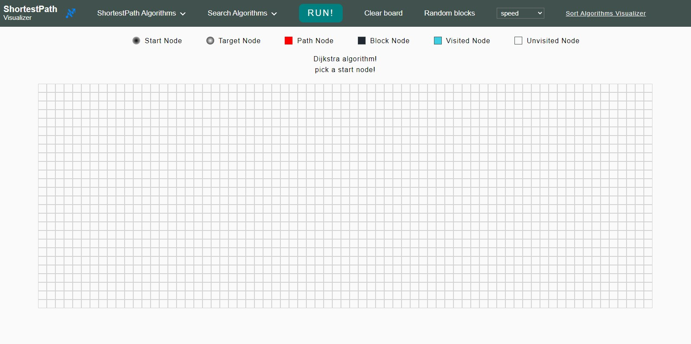
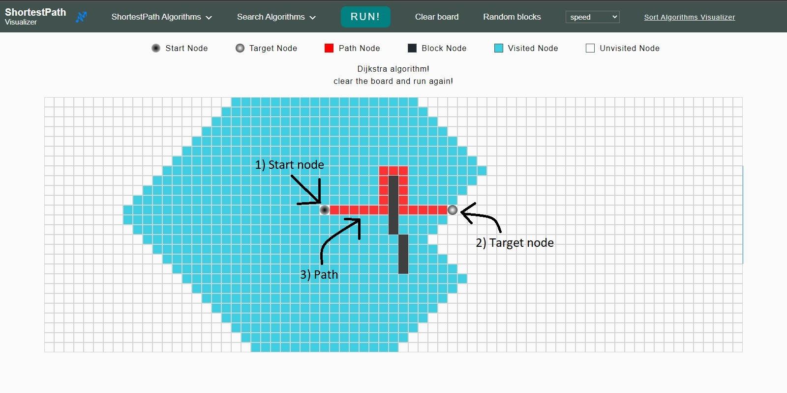
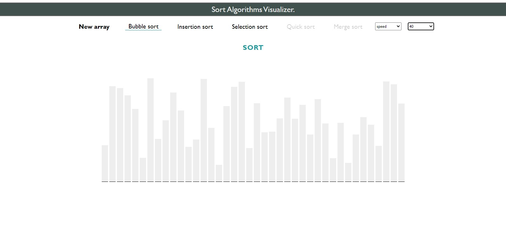
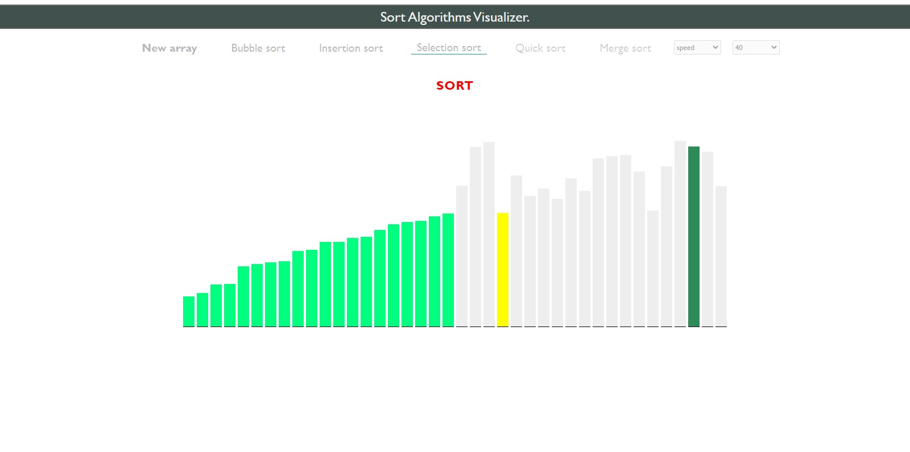

# Shortest Pathfinding Algorithms Visualizer

In graph theory, the ```shortest path problem``` is the problem of finding a path between two vertices (or nodes) in a graph such that the sum of the weights of its constituent edges is minimized.

The problem of finding the shortest path between two intersections on a road map may be modeled as a special case of the shortest path problem in graphs, where the vertices correspond to intersections and the edges correspond to road segments, each weighted by the length of the segment.

*Note: This application visualize ```ShortestPath```, ```Search```, and ```Sort``` algorithms.*
<br>
<br>

## Live Demonstration
The application demo can be viewed online [HERE](https://hmza-smha.github.io/visualization/)
<br>
<br>

## Application for Shortest Pathfinding algorithms:
1. Maps, such as *Google maps, Apple maps...*
2. Networking, such as *Telephone network...*
3. Routing, such as, *IP routing...*
4. Games
<br>


## Shortest Pathfinding Algorithms

| Algorithm  |  Coded?       | Description  |
|----------|:-------------:|:-------------|
| Dijkstra's | &#10004; | It is algorithm solves the [single-source](#notes) shortest path problem with non-negative edge weight |
| A* | &#10004; |It is an algorithm solves for  [single-pair](#notes) shortest path using [heuristics](#notes) to try to speed up the search |
| Bidirectional | soon | It is a searching technique that runs two way. It works with two who searches that run simultaneously, first one from source too goal and the other one from goal to source in a backward direction |

<!-- Bellman–Ford algorithm solves the single-source problem if edge weights may be negative.-->
<br>

## Search Algorithms

| Algorithm  |  Coded?       | Description  |
|----------|:-------------:|:-------------|
| Breadth-First-Search | &#10004; | The algorithm starts some arbitrary node as the root node and explores all nodes at the present depth prior to moving on to the nodes at the next depth level |
| Depth-First-Search | &#10004; |The algorithm starts by selecting some arbitrary node as the root node and explores as far as possible along each branch before backtracking |
| Best-First-Search | &#10004; | IThe algorithm use an evaluation function to decide which adjacent node is most promising and then explore. Best-First-Search falls under the category of ```Heuristic``` (or Informed) search algorithms |
<br>

## Sort Algorithms

| Algorithm  |  Coded?       | Description  |
|----------|:-------------:|:-------------|
| Bubble sort | &#10004; | It compares adjacent elements and swaps them if they are in the wrong order. The pass through the list is repeated until the list is sorted |
| Insertion sort | &#10004; |It places an unsorted element at its suitable place in each iteration|
| Selection sort | &#10004; | It sorts an array by repeatedly finding the minimum element from unsorted part and putting it at the beginning |
| Quick sort | soon | ```Divide and Conquer``` algorithm. It picks an element as pivot and partitions the given array around the picked pivot |
| Merge sort | soon | ```Divide and Conquer``` algorithm. The array is initially divided into two equal halves and then they are combined in a sorted manner |
<br>

<i id="notes">Notes</i>
- ```Single-Source``` shortest path algorithms basically finds the shortest distance between a single node usually specified and all other nodes.

- ```Single-Pair```: shortest path algorithms find the shortest distance between any pair of nodes in the graph.

- ```Heuristic```:  is any approach to problem-solving that uses a practical method or various shortcuts in order to produce solutions that may not be optimal but are sufficient given a limited timeframe or deadline.
<br><br>


## Home Page

The control page,
- Pick the algorithm you want from the dropdown lists 
- Specify the speed of the algorithm
- Get random complex blocks, or draw them by yourself

---

<br>
<br>

## Action Page

In the grid,
- The first click is for ***start*** node,
- The second click is for ***target*** node,
- Then you can drwa ***blocks**.
- Finally, click the ```RUN``` button to see the algorithm in action.

---

<br>
<br>

## Sorting Page

The control page,
- Pick the algorithm you want
- Specify the speed of the algorithm
- Specify the number of the towers

---

<br>
<br>


## Action Page

- Click ```SORT``` and enjoy!

---

<br>
<br>

## Tech Stack
- HTML
- CSS
- Javascript
